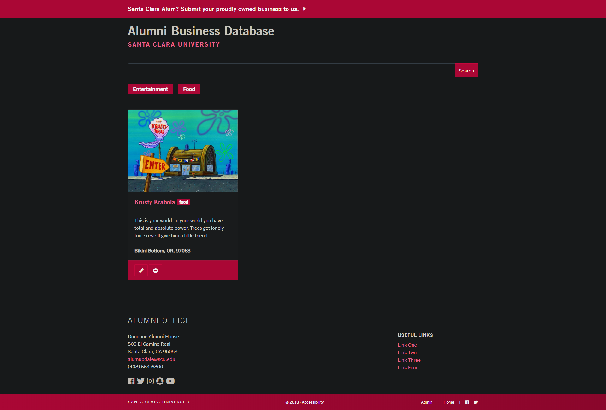
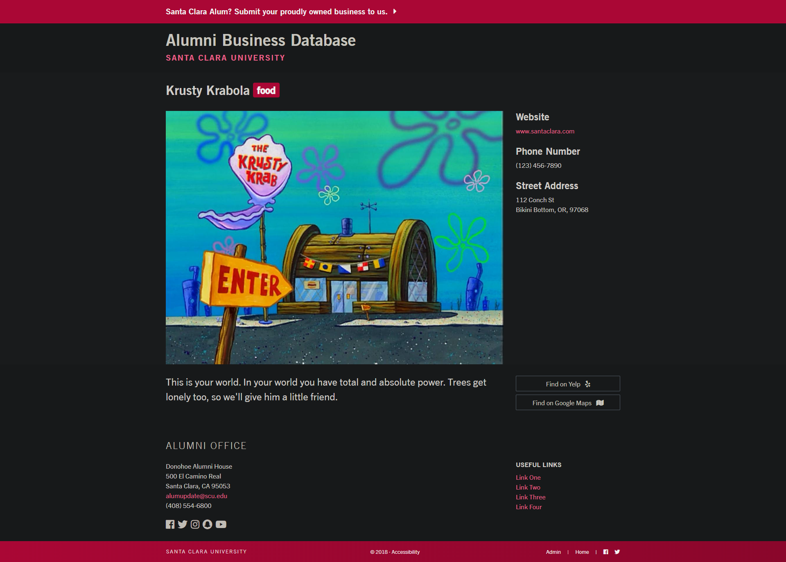
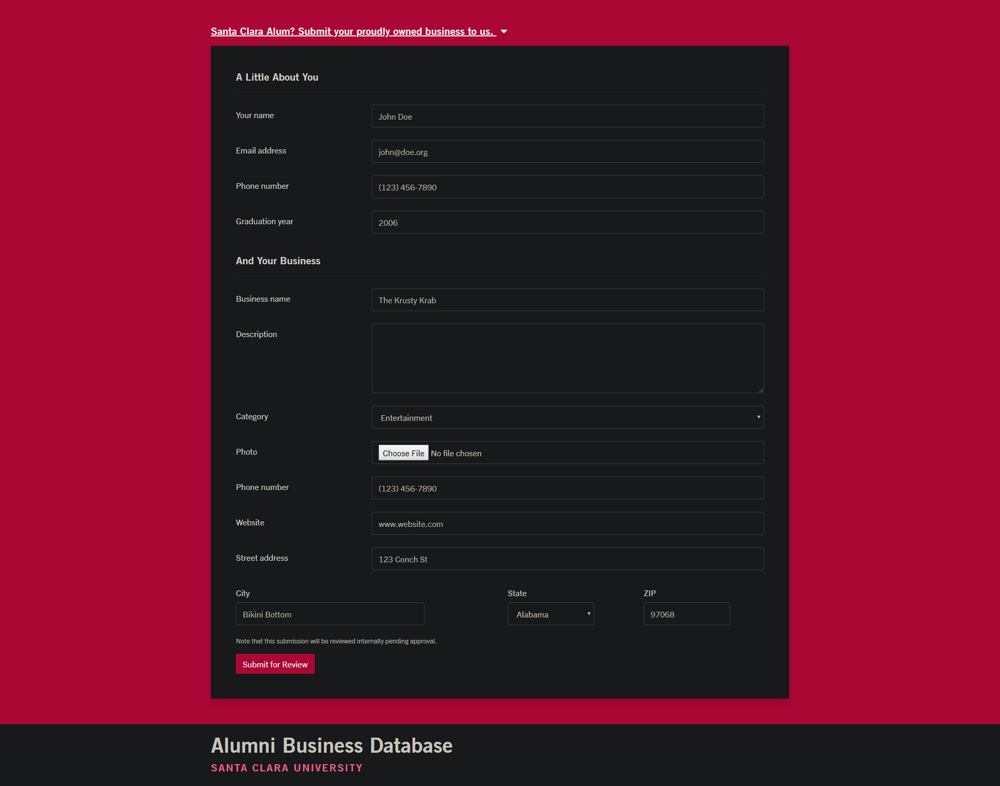
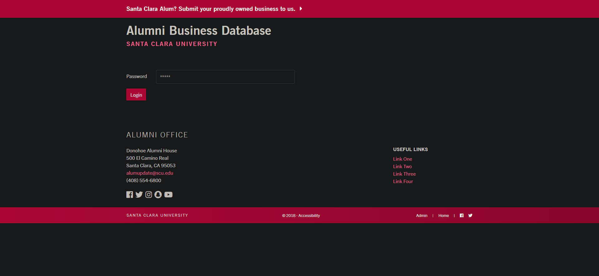

# SCU Alumni Business Directory

## Preview

The Home Page


A Business' Detail Page


The Form to Submit a Business to the Database


The Admin Login Page


The Admin Page for approving new businesses, edits to existing entries, and removals


## Installation

Refer to https://nodejs.org/en/, https://www.meteor.com/install, https://git-scm.com/downloads

### macOS

Install [Homebrew](https://brew.sh/), which is a popular open-source package manager for macOS.

Next, use Homebrew in the terminal to download Node.

```
brew install node
```

Now download Meteor as recommended on the install page linked above. For comfort, you can try `node -v` and `meteor --version`.

The environment is ready to go, so use Git to clone this repository, syncing up automatically.

```
git clone https://github.com/rbergin-scu/software-engineering-lab.git
cd software-engineering-lab
```

Now you can simply start Meteor:

```
meteor
```


## Dependencies

### [Meteor](https://www.meteor.com/)

Meteor is a JavaScript web application framework. It handles routing, databases, viewing, security, and everything else on the server side of things. It also has a ton of its own dependencies which are documented in `package.json` and `.meteor/packages`.

### [React](https://reactjs.org/)

React is a JavaScript library that provides an object-oriented system for constructing view pages. It also includes a special language called JSX, which allows you to write JavaScript directly embedded into HTML in addition to constructing JavaScript objects that represent visual elements.

### [Bootstrap](https://getbootstrap.com/)

Bootstrap is a CSS and JS file that provide lots of well-designed common UI elements, like Navbars and Buttons. The markup is standards-compliant and (mostly) abides by accessibility standards. The stylesheet leverages flexbox for structuring the webpage via rows and columns.

### [Reactstrap](https://reactstrap.github.io/)

Reactstrap is a Nodejs package that contains React models for Bootstrap 4 components like Cards and Navbars. Its primary function is to make it so we do not need to re-write BS4 components into JSX ourselves, which will be messier code.


## Testing

Testing through Meteor is sort of complicated but really powerful. Set up the test environment by running the command:

```
TEST_WATCH=1 meteor test --port 3002 --driver-package meteortesting:mocha
```

Which will enable you to view test results, including errors, live in the browser. Note that there is still terminal output, and sometimes it may be more useful than what you find in the browser.

There's a few different components involved in testing:

- [Mocha](https://mochajs.org/) is the test framework itself, which uses `describe` and `it` to organize tests into discrete units
- [Chai](https://www.chaijs.com/guide/styles/#expect) provides `expect` and other verbose methods like `.should.have.lengthOf(..)` that we use to actually test data
- [Enzyme](https://airbnb.io/enzyme/docs/api/) enables React component testing within Mocha; while still useful, not the main testing dish and will not be used in most tests
- [Faker](https://www.npmjs.com/package/faker) spits out incredibly useful fake test data and has a lot more specific functions than you might expect (e.g. company.catchPhrasehAdjective)

Understanding each of these components is important to writing tests. Essentially, you use Mocha to organize the tests, Chai to write the actual test conditions, Faker to create quick test data, and Enzyme to write React tests. Most tests will be of a single unit. Integration testing is also useful, but will likely be closer to the end of the project/may never be fully fleshed out.

An example of some pretty simple tests can be found here: https://github.com/rbergin-scu/software-engineering-lab/blob/1efc4ae6f8c01701f0fc0953790d43952effbc18/imports/api/businesses/businesses.tests.js


## Deployment

Two components:

- [MongoDB data host](https://mlab.com)
- [Galaxy for Meteor web host](https://galaxy.meteor.com)

Deployment is simple. We use mLab's free tier account to gain access to a 500 MB data store, which is more than sufficient for demo purposes. Galaxy deploys directly through Meteor in the command line, and we use their DNS to host the demo page.

To deploy, create a Production configuration which runs this command:

```
DEPLOY_HOSTNAME=us-east-1.galaxy.deploy.meteor.com meteor deploy scu-alumni-businesses.meteorapp.com --settings settings.json
```

You will need to supply `settings.json` with database info, and have access to the hosting account credentials in order to complete the deployment.

Live page with latest publish: http://scu-alumni-businesses.meteorapp.com
